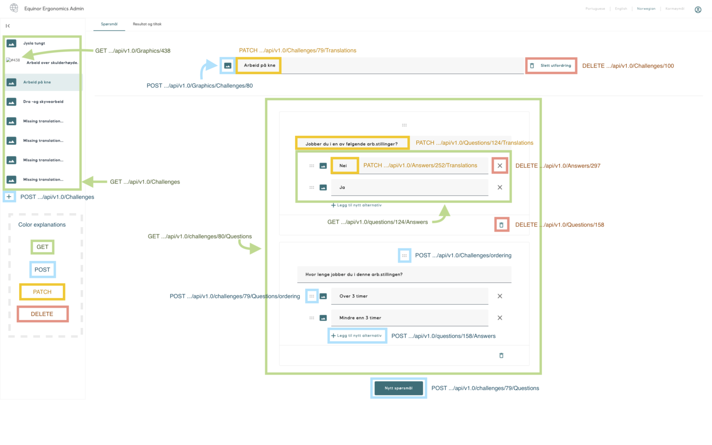

# Equinor Ergonomics | Admin Web Interface

This is a web-admin-interface for the internal app `Equinor Ergonomics`.

## Build status
Todo: Change url for the build-status-indicators (currently pointing to PleaseMove)
|Branch | Build Status|
| ---- | ---- | 
|Master|[](https://statoil-mad.visualstudio.com/PleaseMove/_build/latest?definitionId=192&branchName=master)|
|Develop|[](https://statoil-mad.visualstudio.com/PleaseMove/_build/latest?definitionId=192&branchName=develop)|


## Developer help
### How to get it up and running
```bash
git clone https://github.com/equinor/mad-project-ergonomics-web
cd mad-project-ergonomics-web
npm i
npm start
```
### Run it in a docker container
*Requirements:* [Docker](https://docs.docker.com) installed on your machine.
 
```bash
docker build -t ergonomics . && docker run -p 5001:5001 ergonomics 
```

### Run tests with jest
```
npm test
```

## UI, API-requests and State-handling
The web-app is conversing with an API-backend. Take a look at its
[Swagger](https://ergonomics-api-dev.azurewebsites.net/swagger/index.html).

Here is an overview of the main-screen and api-requests that is used for different actions.


Api-endpoints are defined in `src/services/api/api-methods.js` and triggered by an _action_ (actually from a saga).
We use redux together with Redux-saga to run our async requests and update our state.
Each button in the UI will _dispatch_ an `action` and update the state.

### Separating UI and Logic (Presenter & Controller)
UI should be created to reflect the redux-store. Use `mapStateToProps` to listen to the state.

Try to not modify the data that is received from the state in the ui-view. Instead, make a new `selector`. 
This will make it easier to keep the code clean and to write good tests.

## More info
This project was initially forked from [mad-webapp-template](https://github.com/equinor/mad-webapp-template). Check it out if you have any questions to the base-setup.
